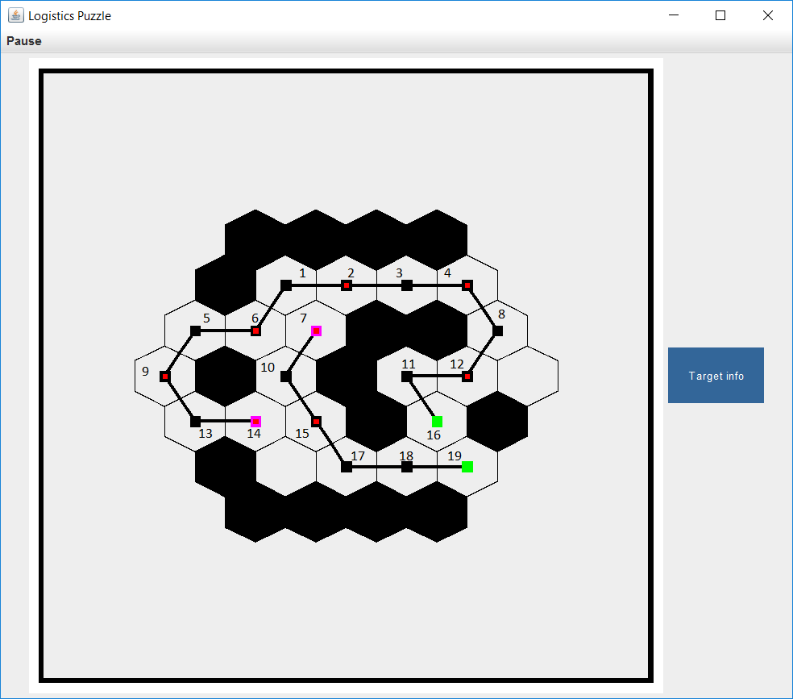
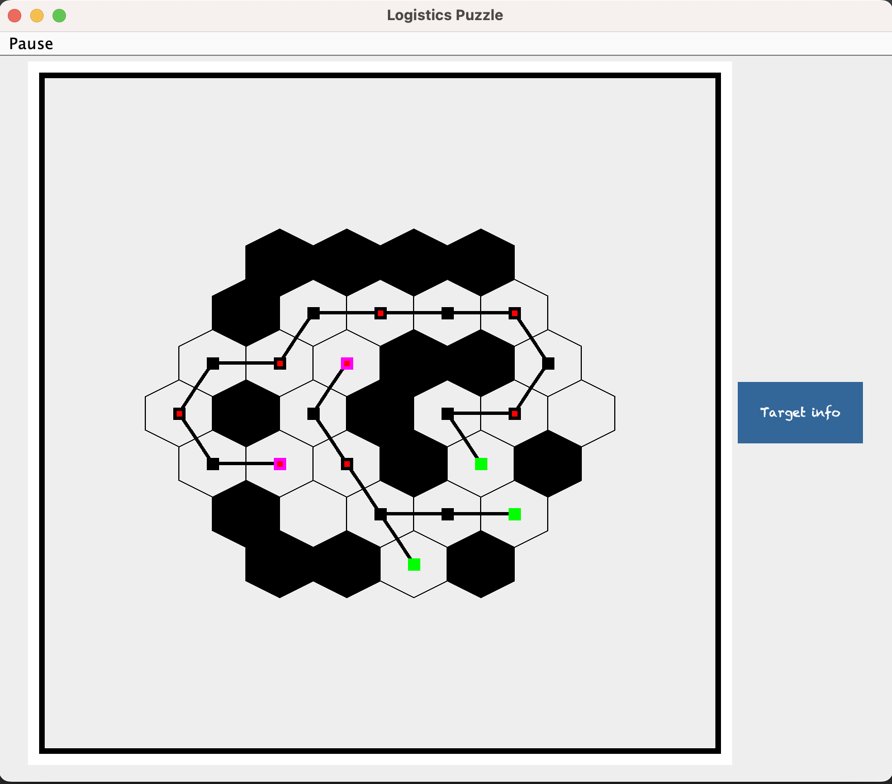
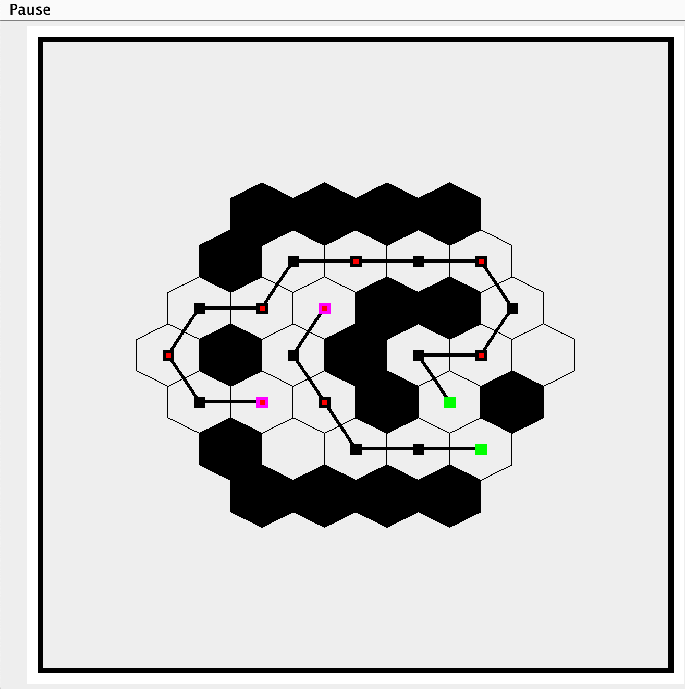

# Production Factory Belt System Simulation

This project involves the development of classes and methods to create an application that simulates a Production Factory Belt System. The primary focus of the project is on implementing a comprehensive loading system, a unique hexagonal coordinate system, and an efficient path iteration system. These components, along with their associated supporting classes, constitute the core functionality of the system.

## Project Scope

For this project, the emphasis was on creating code based on the provided JavaDoc. The development strategy involved concentrating efforts on a specific aspect of the larger project. The primary goal was to ensure the smooth interaction between my code and the evolving GUI system and factory components currently in development.

## Production Belt Factory Simulator

A key aspect of this project was the creation of a Production Belt Factory Simulator. This simulator involves the implementation of classes and methods necessary to model the operation of a factory production line. The simulation system required the design and implementation of a robust file loading mechanism. This mechanism is responsible for loading and parsing specific text data stored in a predefined format within .txt files, as outlined in the JavaDoc specifications.

## Hexagonal Node Functionality

The heart of the factory's production line consists of hexagonal nodes, each serving a unique purpose within the production belt system. These nodes include:

- **Producer**: This node generates an Item every second cycle.
- **Consumer**: Responsible for consuming Items that arrive via the Belt system.
- **Belt**: A pathway node that facilitates the unidirectional flow of items from Producer to Consumer.

Additionally, the factory grid features Open and Wall hexagonal nodes, further enhancing the complexity of the simulation.

